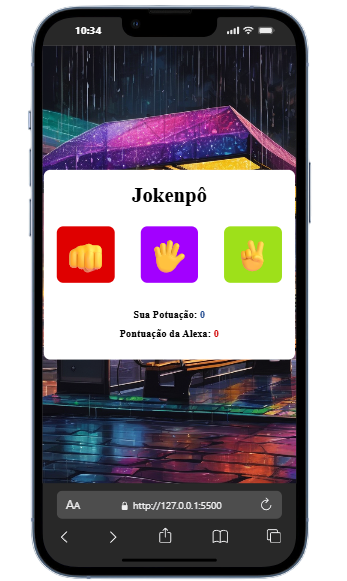
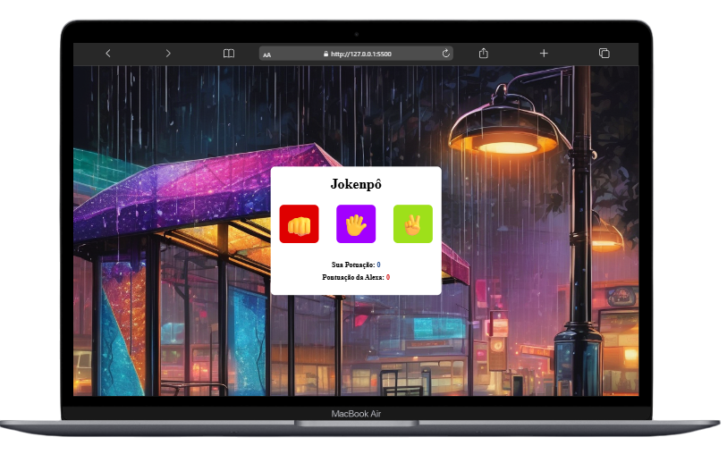

# 🎮 Jokenpô - Pedra, Papel e Tesoura

Um simples jogo de *Jokenpô (Pedra, Papel e Tesoura)* desenvolvido em <strong>HTML, CSS e JavaScript</strong>, onde você joga contra a **Alexia**.  
O objetivo é escolher uma das três opções e tentar vencer a Alexia. A cada rodada, a pontuação é atualizada para mostrar quem está na frente.  

---

## 🚀 Funcionalidades

- Três botões de escolha: **Pedra**, **Papel** e **Tesoura** 
- Sistema de pontuação para o *Jogador* e para a *Alexia*  
- Exibição do resultado de cada rodada  
- Interface simples e intuitiva  

---

## 🖼 Demonstração


<p align="center">
  
  
</p>

---

## 🛠 Tecnologias utilizadas

- *HTML5* → Estrutura do projeto  
- *CSS3* → Estilização e layout  
- *JavaScript (Vanilla JS)* → Lógica do jogo e interação

---

## 📂 Estrutura de arquivos

```bash

├── index.html    # 🧱 Estrutura principal do jogo
├── style.css     # 🎨 Estilo da interface
├── script.js     # 🧠 Lógica do Jokenpô
└── assets/       # 🗂️ (opcional) imagens, ícones ou prints do jogo
```
---

▶️ Como usar o projeto
Você pode executar o projeto localmente de forma simples, sem precisar instalar dependências ou configurar servidores. Basta seguir os passos abaixo:

🔧 Requisitos
Um navegador moderno (como Google Chrome, Firefox, Edge, etc.)

(Opcional) Um editor de código como Visual Studio Code para explorar e modificar os arquivos

---
📦 Passo a passo

 1 - Baixar o projeto
Você tem duas opções:

Via Git (recomendado):

```Bash
git clone https://github.com/Klausdmkb/Projeto--Jokenp---JS.git
```
- Via ZIP
  
- Clique no botão verde Code no topo do repositório

- Selecione Download ZIP

- Extraia os arquivos em uma pasta local

2 - Abrir o projeto
Navegue até a pasta onde os arquivos foram salvos

- Dê dois cliques no arquivo index.html

- O navegador abrirá automaticamente a interface do sistema
---

💡 Dica extra
Se estiver usando Visual Studio Code, você pode instalar a extensão Live Server para abrir o projeto com recarregamento automático:

Instale a extensão “Live Server”

Clique com o botão direito no index.html

Selecione "Open with Live Server"


---

📌 Melhorias futuras

- 🔊 Adicionar sons e animações  
- 🎯 Criar níveis de dificuldade  
- 🔄 Implementar um sistema de reset da pontuação  


---

## 📄 Licença

-Este projeto foi desenvolvido com fins educacionais como parte dos estudos realizados na plataforma **DevClub**, sob orientação do professor **Rodolfo Mori**.

-Você pode utilizar, modificar e compartilhar este código livremente para fins de aprendizado e prática pessoal.  
-Caso deseje utilizar em projetos públicos ou comerciais, recomenda-se manter os créditos originais.

**Todos os direitos de ensino e metodologia pertencem ao DevClub e Rodolfo Mori.**

🚀 Aprenda mais em: [https://devclub.com.br](https://devclub.com.br)
